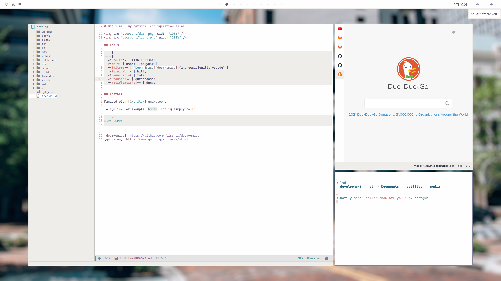

# Dotfiles - my personal configuration files




## Tools

| | |
|-|-|
| **Shell:** | fish + fisher |
| **WM:** | bspwm + polybar |
| **Editor:** | [Doom Emacs][doom-emacs] (and occasionally vscode) |
| **Terminal:** | kitty |
| **Launcher:** | rofi |
| **Browser:** | qutebrowser |
| **Notifications:** | dunst |


## Install

Managed with [GNU Stow][gnu-stow].

To symlink for example `bspwm` config simply call:

``` sh
stow bspwm
```


[doom-emacs]: https://github.com/hlissner/doom-emacs
[gnu-stow]: https://www.gnu.org/software/stow/
